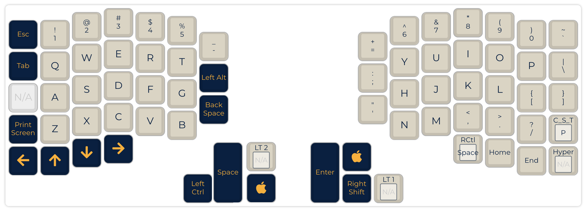
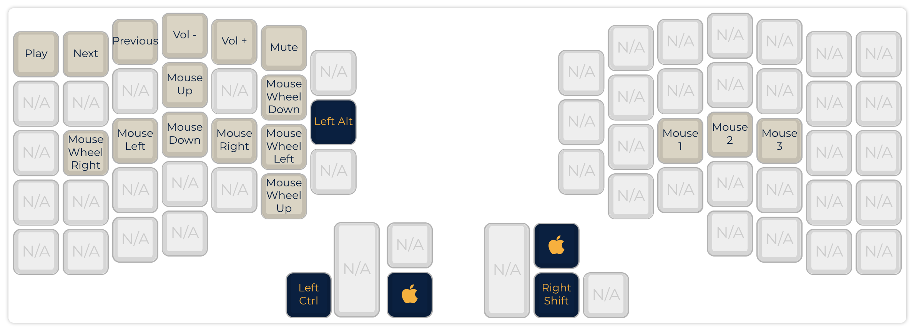
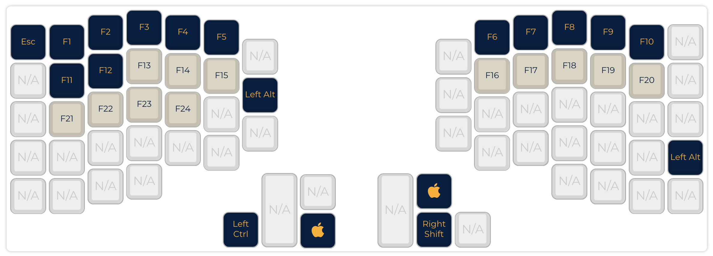

# My ergodash Keymap

## Layer1

## Layer2

## Layer3

## Thanks to QMK.fm

This layout was generated by the QMK API. You can find the JSON data used to
generate this keymap in the file layers.json.

To make use of this file you will need follow the following steps:

* Download or Clone QMK Firmware: <https://github.com/qmk/qmk_firmware/>
* Extract QMK Firmware to a location on your hard drive
* Copy this folder into %s
* You are now ready to compile or use your keymap with the source

More information can be found in the QMK docs: <https://docs.qmk.fm>

